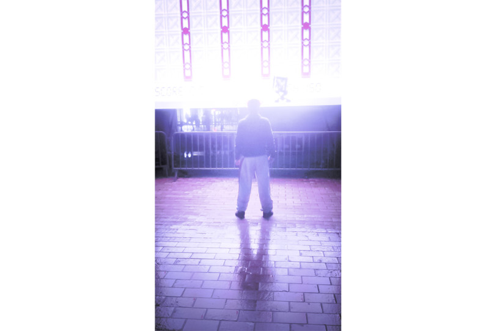
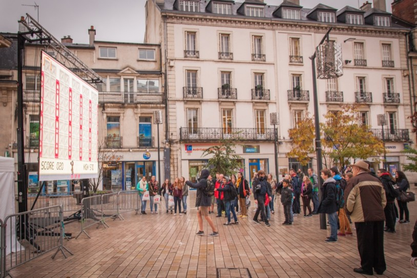
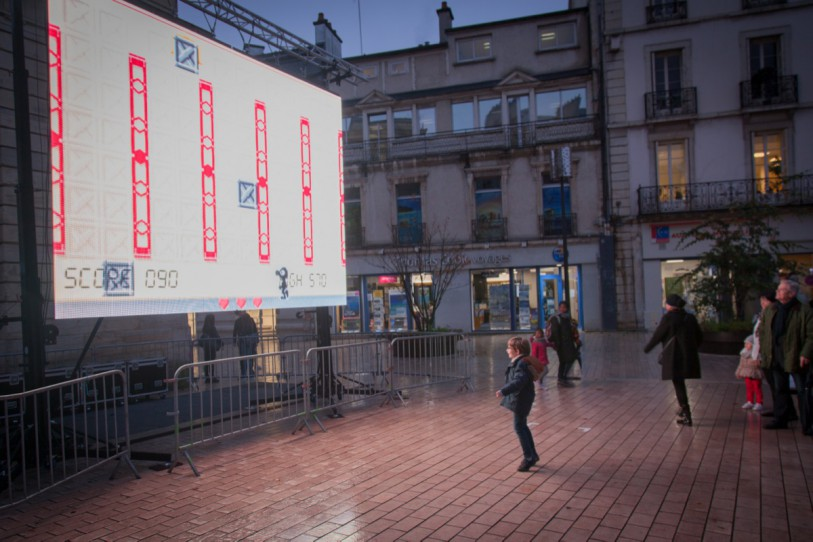
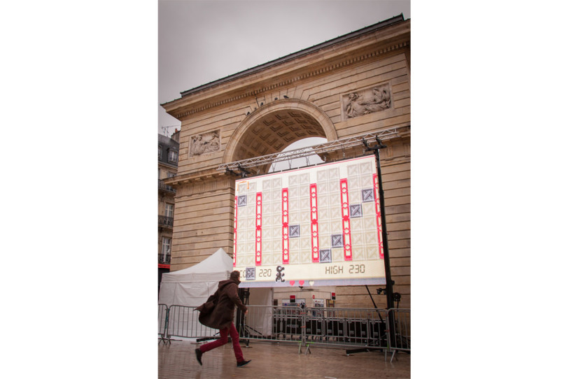

# Game and Watch

[Game and Watch](https://arthursw.github.io/game-n-watch/)

A camera based [Game'n'Watch](https://en.wikipedia.org/wiki/Game_%26_Watch) to play in the street with a large LED screen or videoprojector.

[Installation by La Sophiste](http://www.lasophiste.com/portfolio/gamenwatch/) and [3Hit Combo](http://www.3hitcombo.fr/).

Re-developed with [PoseNet](https://github.com/tensorflow/tfjs-models/tree/master/posenet) from Google.

## Usage

The PoseNet model is used to track each body part of the player.

### Rules

 - The goal is to catch as many boxes as possible to get the highest score possible.
 - The player controls the character by moving left and right in the game area.
 - At the beginning of the game, the player has four lives.
 - Each time the player misses a box, he looses one life.
 - The game stops when the player has no more lives.
 - If the score of the player is higher than the previous high score, the new high score is recorded.

## Settings

### Game'n'Watch

The PoseNet model gives a confidence score for each detected body. The game only considers the body with the highest confidence score in the detection area.

##### Game area margins

The margins settings enable to set the game area by defining a detection region on the video of the camera.

The detection region is used to ignore detected bodies which are not in the game area. All bodies which have the given body part (see the *Body part* setting in *Game'n'Watch*) higher than the upper bound or lower than the lower bound of the detection region are ignored.

The left and right bounds of the detection region are used to set where the maximum left and right position fo the player. Passed those limits, bodies are not ignored but the game character does not follow the tracked player anymore.

##### Body part

The character can be controlled with the nose of the player - useful to test the game on a computer with a webcam - or with the feet of the player - more appropriate to play with the whole body and a wide screen.

#### Difficulty

*Level duration* corresponds to the amount of time the player has to "survive" until he reaches the next level.
The frequency at which new boxes are dropped increases at each level. The *level speed increase* settings corresponds to the amount of seconds subtracted to the period at which boxes are dropped.

#### Video mapping tools

Check video mapping tools to be able to map the video output to fit the projection surface.

##### Controls

Since the idea is to have a projector aimed all crazy-like, the controls are all keyboard and mouse based since any UI would either get in the way, or would be impossible to see in most cases anyway.

`SHIFT` + `Space` Toggle edit mode

###### While In Edit Mode

`click` or `drag` select and move quads/corner points

`SHIFT` + `drag` move selcted quad/corner point with 10x precision

`ALT` + `drag` rotate and scale selected quad

`SHIFT` + `ALT` + `drag` rotate and scale selected quad with 10x precision.

`Arrow keys` move selected quad/corner point

`SHIFT` + `Arrow keys` move selected quad/corner point by 10 pixels

`ALT` + `Arrow keys` rotate and scale selected quad

`'s'` Solo or unsolo the selected quad (hides all others). This helps to adjust quads when corner points are very close together.

`'c'` Toggle mouse cursor crosshairs

`'b'` Toggle display bounds/metrics

`'r'` Rotate selected layer 90 degrees clockwise

`'h'` Flip selected layer horizontally

`'v'` Flip selected layer vertically

#### Fullscreen

Use the *Fullscreen* button to set the fullscreen mode, use the `Escape` key to return to windowed mode.

### Detection

The Game'n'Watch works fine with the default detection settings.

See the [PoseNet model](https://github.com/tensorflow/tfjs-models/tree/master/posenet) for more details about those settings.

##### Single-Person Pose Estimation

Single pose estimation is the simpler and faster of the two algorithms. Its ideal use case is for when there is only one person in the image. The disadvantage is that if there are multiple persons in an image, keypoints from both persons will likely be estimated as being part of the same single pose—meaning, for example, that person #1’s left arm and person #2’s right knee might be conflated by the algorithm as belonging to the same pose.

##### Multi-Person Pose Estimation

Multiple Pose estimation can decode multiple poses in an image. It is more complex and slightly slower than the single pose-algorithm, but has the advantage that if multiple people appear in an image, their detected keypoints are less likely to be associated with the wrong pose. Even if the use case is to detect a single person’s pose (as on Game'n'Watch), this algorithm may be more desirable in that the accidental effect of two poses being joined together won’t occur when multiple people appear in the image. It uses the `Fast greedy decoding` algorithm from the research paper [PersonLab: Person Pose Estimation and Instance Segmentation with a Bottom-Up, Part-Based, Geometric Embedding Model](https://arxiv.org/pdf/1803.08225.pdf).

##### Inputs

* **MobileNet Architecture** - Architecture: there are a few PoseNet models varying in size and accuracy. 1.01 is the largest, but will be the slowest. 0.50 is the fastest, but least accurate.

* **Output stride** - the desired stride for the outputs when feeding the image through the model.  Must be 32, 16, 8.  Defaults to 16.  The higher the number, the faster the performance but slower the accuracy, and visa versa.

* **Image scale factor** - A number between 0.2 and 1.0. Defaults to 0.50.   What to scale the image by before feeding it through the network.  Set this number lower to scale down the image and increase the speed when feeding through the network at the cost of accuracy.

##### Single-Person Detection

Pose confidence: the overall confidence in the estimation of a person's pose (i.e. a person detected in a frame).

* **Min pose confidence** - The confidence threshold below which a person pose is ignored.

* **Min part confidence** - The confidence that a particular estimated keypoint position is accurate (i.e. the elbow's position)

##### Multi-Person Detection

* **Max pose detections** - The maximum number of poses to detect.
* **Min pose confidence** - The confidence threshold below which a person pose is ignored.
* **Min part confidence** - Only return instance detections that have root part score greater or equal to this value.
* **NMS radius** - Non-maximum suppression part distance. It needs to be strictly positive. Two parts suppress each other if they are less than `nmsRadius` pixels away. Defaults to 20.

